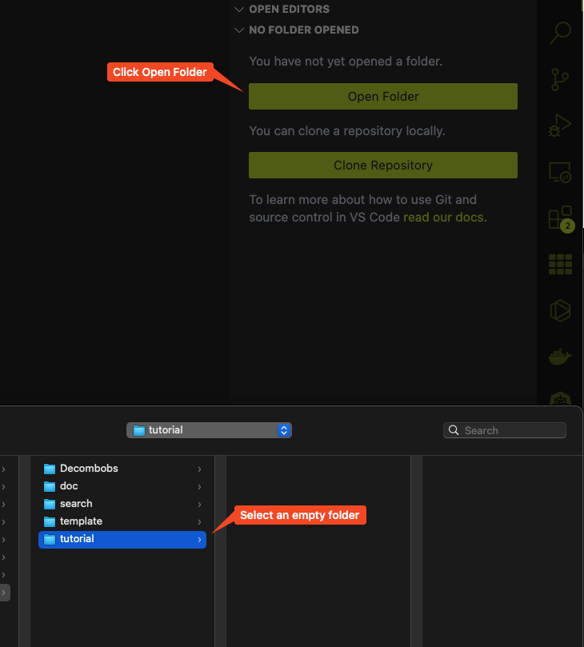

# Setting up your local development environment

In this section, we will learn about how to set up your local development environment so you can get used to using basic functionality provided by VSCode as well as how to open folder, create and delete file, and using Live Server to host a local website.

> <p class="note"> Note
>
> By default, your **TASKBAR** should be on the **LEFT OF THE SCREEN**.
>
> In all of the VSCode image going forward, the task bar is displayed on the right side of the screen due to the author preference (I would recommend you to also put taskbar on the right to improve code readability), this is purely for User Experience purpose and does not affect the functionality of VSCode in anyway.

## Step 1

First, open up your VSCode and click on the `Explorer` icon to open up your working folder.


Next, click on the `Open Folder` icon to select a folder you want to put your website inside and open it up in VScode.

> <p class="warn"> Warning
> 
> Please make sure that the folder you are selecting is **EMPTY**, else your website might not work.



You know that it open properly when you see the name of your folder reflected in the explorer.


## Step 2

Now we will try to create a new file and name it `index.html` in the folder. 

To do so, just simply, right click on the empty space in the explorer and you should see an option for `New file...` pop up. Click on that and it will create a new file in the folder for you. Then, you can name the file `index.html`. Double click on the file to open it up in VSCode.


## Step 3

Now let try to add something into the file so that we can test out our Live Server plugin. You can click on the `Explorer` icon again to collapse the side bar so it does not take up too much space on your screen. Copy and paste the following code into the file.

```html
<body>
    Hello my project's website!
</body>
```

> <p class="note"> Note 
> 
> All the code snippet in this tutorial like the one above can be easily copied using the copy button on the right of the snippet box. To show the copy icon, you just have to hover your mouse over the code snippet and it will appear. We suggest using this instead of highlighting and copy to prevent error.
> 

Press `Ctrl + S` (or `Cmd + S` if you are using a Mac) to save the file and you are set.

## Step 4

Now let see the magic of the Live Server plugin. If you click on the Live Server symbol at the bottom right of your screen, you will see it says `Starting...` and finally open up a brand new browser window with the index.html file you just created on it. 

> 

You should be able to see on the browser the sentence:

> 

At the address `127.0.0.1`. Now, you can freely close this browser window if you woud like to. If you want to open it again, just simply type into your browser search bar the following address:

> localhost:PORT

Where the port number is the PORT value given by the Live Server plugin display at the bottom right of your VSCode like so.


So in our example, that would be:

> localhost:5500 

And it should open the browser right back up.

## Step 5

Now, the reason we need Live Server Plugin is so that we can simplify a process often refer to as "Hot-reloading" meaning that we can see the change being reflected immediately on our local website, the moment we make a change to our code.

To test out this feature, you can randomly change the portion of text between the two `<body>` tag to something else and see it being change on your local website in real time. For example, let change it to:

```html
<body>
    1 year sound a bit long isn't it?
</body>
```

Save the change you made to the file, and immediately see the new text being reflected on your browser window.

Now, remember, if you close VSCode, the Live Server will be disposed automatically and you would need to click on it to activate it again. You could also intentionally dispose it by click on it while it is running (you know it is running when it said `PORT: XXXX`). After disposing it, you will not be able to access the website locally anymore.

And that will wrap up this section.


