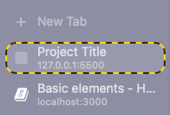

# Basic elements

There is a few basic elements that you need to know how to use in HTML to display your portfolio. We will go through them one by one in this section.

## Basic HTML knowledge

In HTML, you define what to be displayed on your website using `elements`. Each element is defined by a pair of `tags`. For example:

```html
<p></p>
<body></body>
```

For most of the elements, this is the standard definition. However, some elements don't have a closing tag, which is the one with the `</xxxx>` such as `<link>`, so don't get too confuse if some elements don't follow the rule above.

## HTML \<title\>

First, open up your `index.html` file in VSCode. You should see an elements call `<head>`. This is where you put all the metadata - the data that is used to describe your website but is not neccessarily be displayed visually. It should look something like this:

```html
<head>
  <meta charset="UTF-8">
  <meta name="viewport" content="width=device-width, initial-scale=1.0">
  <meta http-equiv="X-UA-Compatible" content="ie=edge">
  <title>Project Title</title>

  ..... other random stuff here

</head>
```

What we want to focus on is the `<title>` element. This is where you defined the title that will be displayed on the tab of your brower. What do I mean by that? It is this thing over here:



Just change the title to anything that you want such as your project title or ID. It is just a way for users to identify your website from other browser tabs.

## HTML \<body\>

The bulk of your content will stay inside the `<body>` element. It looks something like this:

```html
<body>
    <div class="content">

    ....
    </div>
</body>
```

To make sure that your content looks nice on a monitor and phone, put your content in between the:

```html
<div class="content">
...
</div>
```

element. We have developed some styling to make sure that the content has some padding so it does not flush against the edge of the screen. However, you don't have to, or configure it to your liking. This is up to personal choice.

Just remember that if you want to add some content, you should add it inside the `<body>` element. If you need padding for your content to look nice, add it in between the `<div class="content">`

## HTML headings

In HTML, there are six different level of headings element. They are:

```html
<h1></h1>
<h2></h2>
<h3></h3>
<h4></h4>
<h5></h5>
<h6></h6>
```

If you look at the template, you should see that the `Project title` is in between a `<h1>` tag. In HTML, the headings is usually use to communicate clearly the hierarchy of text and often used as a way to mark the level of important of a title.

In this template, more specifically, we use:
- `<h1>` to mark the project title and should only be used once at the top of your website.
- `<h2>` to mark section headers
- `<h3>` to mark sub-section headers
- And so on, if you need headers for further sub-sections

This keep the text hierarchy clear and easy to maintain. Take a bit of your time to tweak the template and play with it to understand more about the styling of each headings. It will be helpful as you further design your website.

## HTML sectioning

We section thing in a HTML by using the `<div>` element. You should see this happen a lot in the template. Let say if I want to designate some content as belong to the first section. I do:

```html
<div id="section-1">
    <h2> 1. Section 1</h2>
    <p> Some text go here </p>
</div>
```

The `id` attributes is what is used to identified the section, it will be very important later on so we can use it as a way to link our reference to this section.

You can nest multiple `<div>` within each other if you want to create sub-sections to sub-sections to so on. However, do be aware that as you nest more and more `<div>` within each other, your website can get more and more convoluted and hard to maintain. We suggest keep the nesting to minimal.

## Text, Link and List

In HTML, there is various ways to display text, but there is only 3 main basic one that you need to know:

```html
<p></p> - use for paragraph
<a></a> - use for link
<li></li> - use for list items
```

### Text

It is quite straightforward to add text on the website, you just have to put the content that you want to display in between the `<p>` tag. For example:

```html
<p>
    Vitae proin sagittis nisl rhoncus mattis rhoncus urna neque viverra. 
</p>
```

Place it as whereever you wish, but usually it should be within a `div` of a particular section. 

### Link

To add a link, you use the `<a>` element. Here is an example of a simple link that point to the `section-1` we created earlier.

```html
<a href="#section-1">
the text that represent your link
</a>
```

The `href` attribute is used to specify the url / path to a location within or outside of the website. In this case, the `href` contains the path to an element on the website. Please pay attention to the `#` in front of the `section-1`. This is important as all `id` name need to be prefixed with a `#` for the `href` to work properly. You can also point to a link out of our template by doing:

```html
<a href="https://www.google.com/" target="_blank">
the text that represent your link
</a>
```

The attributes `target="_blank"` will prevent the link open up an external website on the tab you are using. It will open the external website on a new browser tab instead. It makes for better user experience. You don't have to do this for link that point to iternal section within your website.

The text in between the tag is basically what you see as the classic underlined blue link text on most website out there. It is just a representation for the linke without it being outright the url itself.

### List 

There are two main ways to display a list of thing on a website. First is an unordered list:

```html
<ul>
    <li> Item 1 </li>
    <li> Item 2 </li>
</ul>
```

The second one is an ordered list:

```html
<ol>
    <li> Item 1 </li>
    <li> Item 2 </li>
</ol>
```

Experience for yourself what is the difference between them, but it should be quite obvious how they are different.


