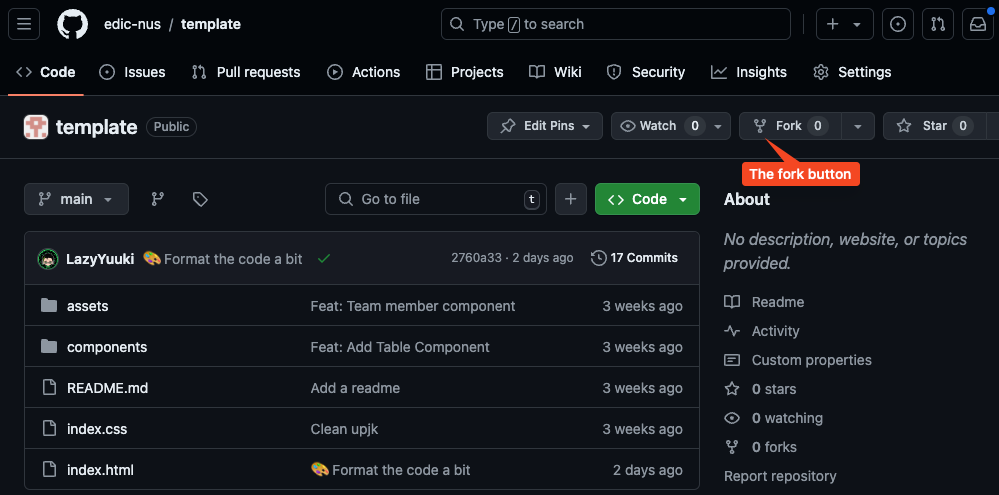
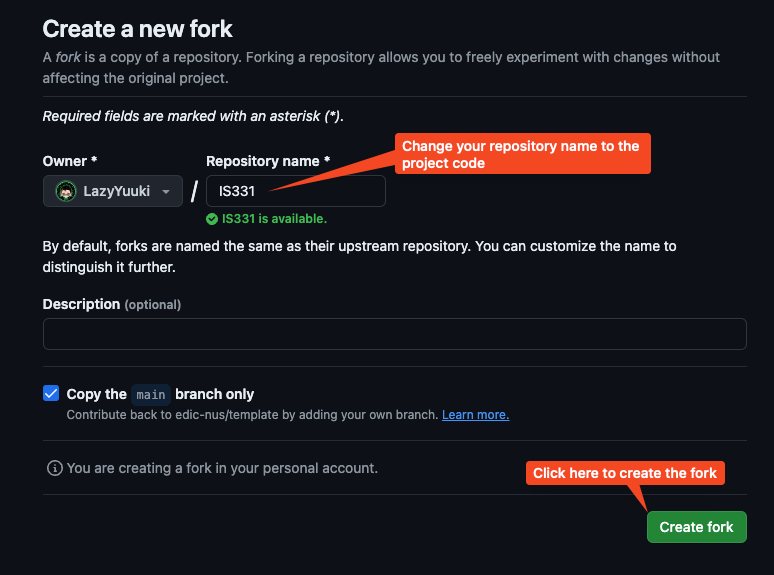
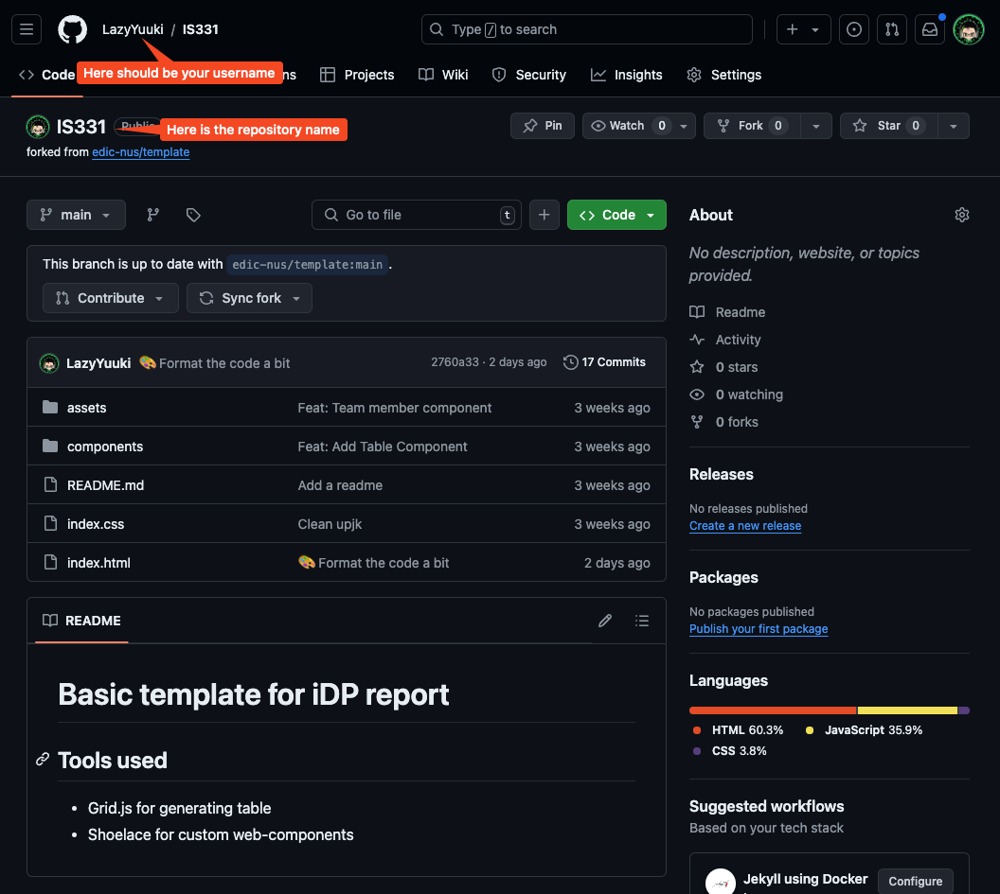
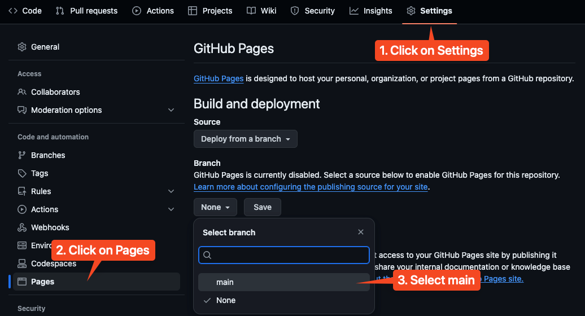
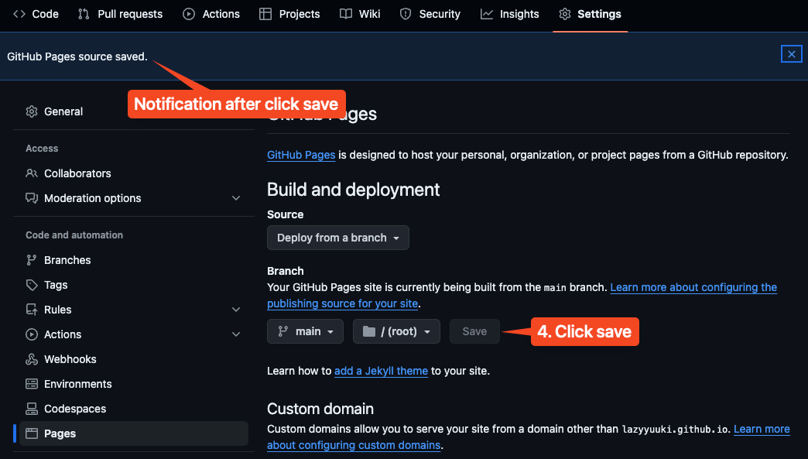
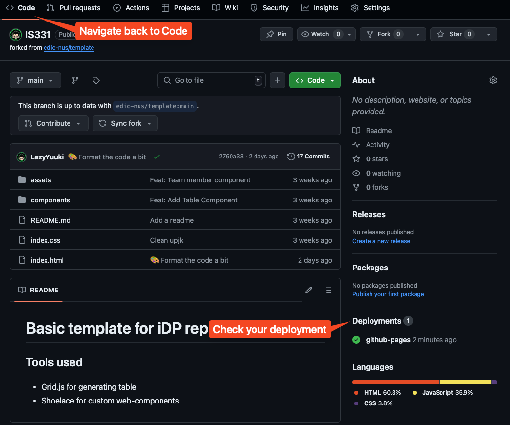
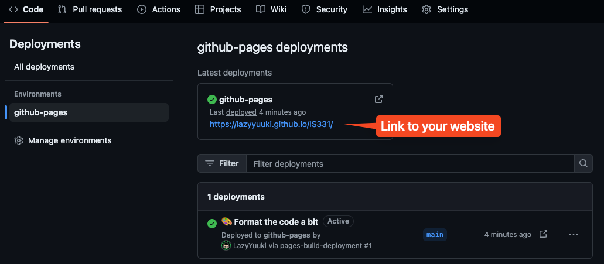
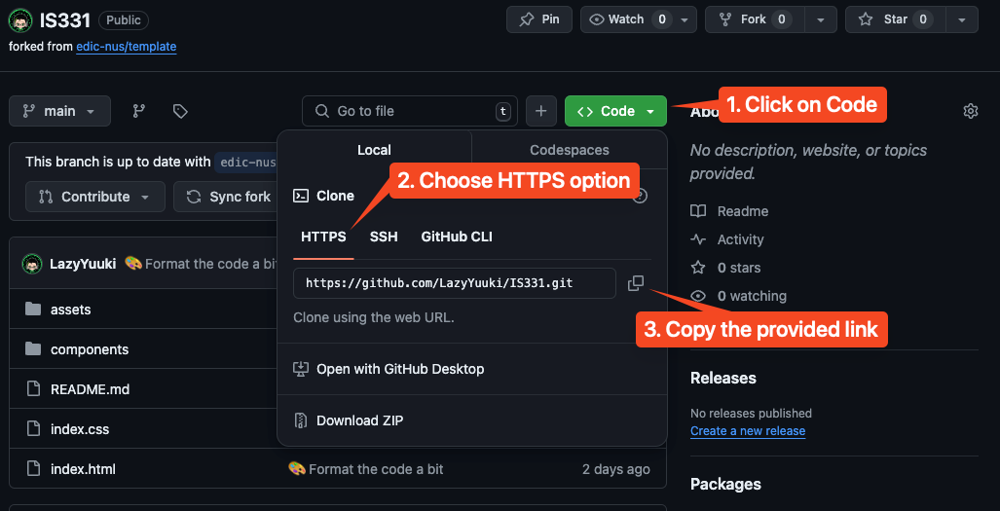
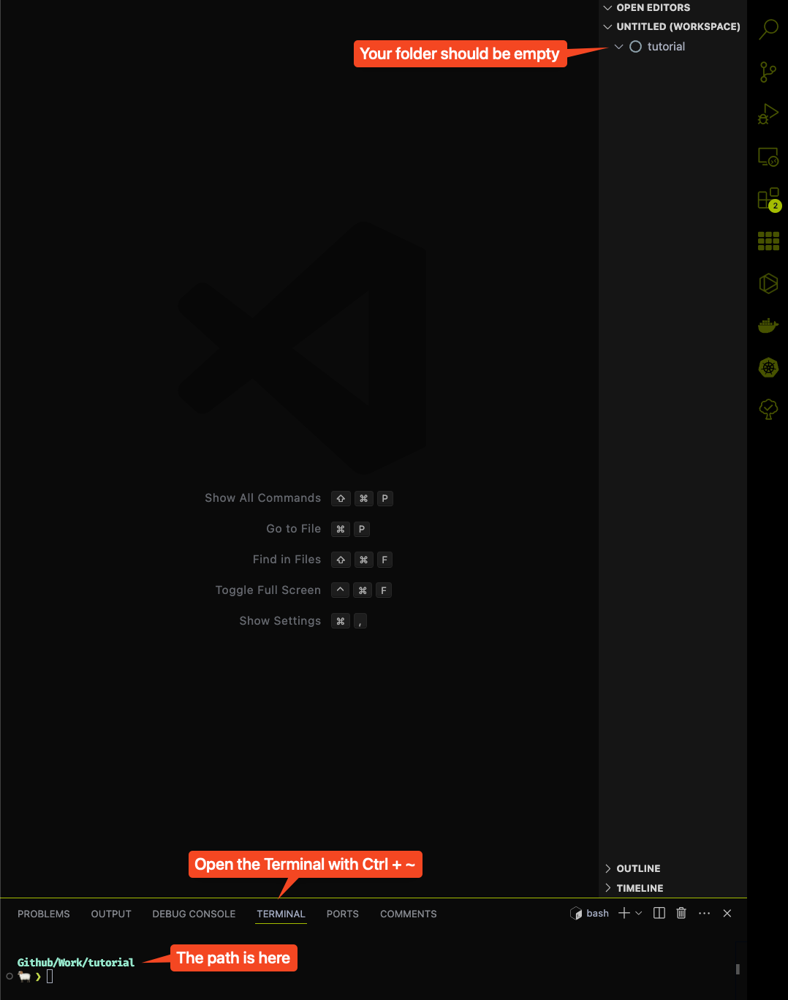
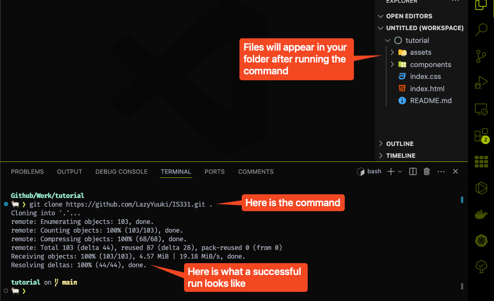

# Work with Git and Github

We will now learn how to use Git and Github to clone the template, make trackable changes and update to the codebase and finally deploy your website to Github for everyone to view it. If you have never done web development before, this will probably be your first proper website that you can show to other as part of your portfolio.

## Setting up your Github

In the [installation](../installation.md), we have asked you to create a Github account. Now, we will teach you how to set it up. The first thing that you need to is to go to this [link](https://github.com/edic-nus/template) and then fork the repository. This is actually where all the code to the demo website that was shown to you is hosted. You can consult this following [guide](https://docs.github.com/en/pull-requests/collaborating-with-pull-requests/working-with-forks/fork-a-repo#forking-a-repository) from Github on how to fork a repository, if you prefer to learn from the source.

To fork a repo, you need to click on the fork button:



After you click on the fork button, it will take you to the fork creation page. Change the repository name to your project code, and then click `Create fork`:



Now you should see the fork of the template being created in your Github with the repository name as you have give:



## Deploying your website on Github

Now that we have the template code, let immediately set up the deployment of your website. Github has made it extremely simple to do so. Follow these steps:

1. Click on the `Settings` tab on top.
2. Click on the `Pages` option on the left side bar.
3. Under the `branch` option under the `Build and deployment`, change from `None` to `main`.
4. Then finally click `Save`.





There should be a notification that pop up to tell you that the setting has been save, and your website should be deployed in around 1 minute. Next, navigate back to the `Code` tab, and monitor your `Deployments`.



If the deployments show a `gihub-pages` with a green mark, that means your deployment is successful. You can click on it, and it will open up a page to show you the link to your brand new freely hosted website.



Congratualtions! You have successfully deployed your first website! You can share it with others and see that it should work on any devices with an internet connection. Fun fact, this is actually how a lot of technical blog, or just normal blog is being hosted for free, since it is easy to deploy and doesn't cost anything thank to Github of course.

## Cloning the repository to your local environtment

Now, we will learn how to clone this repository online to our device to develop locally.

> <p class="warn"> Warning
>
> Please pay careful attention to this section, as setting your git up wrongly could really introduce a lot of headache and preventing you from moving onward, unless you know what you are doing.
>
> If at any point, you think you did something wrong, or encounter error that you could not resolve. You can just simply delete the whole folder, and creating a new one again like in [section 1.1](./local-development.md).

We will refer to this guide [here](https://docs.github.com/en/pull-requests/collaborating-with-pull-requests/working-with-forks/fork-a-repo#cloning-your-forked-repository) as we move forward with cloning our forked repository. On **your forked repository**, you should see a big Green button that say `<> Code`. Click on that, select `HTTPS` option, and click on the copy button to copy the link provided.



Now, open up your VSCode and your working folder we have created in the previous section. Delete your `index.html` file, or anyother file that you might have in that folder, so that we have an empty folder. Then, press `Ctrl + ~` to open up your terminal.



Don't worry if your terminal doesn't look like the one in the image. It is just the author own customization. But your path should have the name of your folder appear in the terminal, in this case it is `Github/Work/tutorial`.

> <p class="note"> Note
>
> Your path might look more like this `~/some/path/to/tutorial`. As long as the last word in the string that appear in your terminal is the name of the folder you create, you are good to go.

Now, in the terminal, paste in this command using the link that you get from Github earlier on:

```shell
git clone https://github.com/YOUR-USERNAME/project-code.git .
```

For example, mine would be:

```shell
git clone https://github.com/LazyYuuki/IS331.git .
```

> <p class="warn"> Warning
>
> Don't forget the dot `.` at the end of the command above.


Press enter to execute the command, if it askes for a password, just enter your Github password, you should see the following output:



And congratulations, you have successfully bring the template code to your local environment for development.

## Configuring git to update the template if there is a change to it

For the last step, we just have to set up our Git such that if the original template has any updates or bug fixes, you would receive it too. We will use this [guide](https://docs.github.com/en/pull-requests/collaborating-with-pull-requests/working-with-forks/fork-a-repo#configuring-git-to-sync-your-fork-with-the-upstream-repository) to set it up. In VSCode, execute the following in the terminal:

```shell
git remote -v
```

You should see something like this, but with your username and repository name instead:

```shell
git remote -v

origin  https://github.com/Username/Project-code.git (fetch)
origin  https://github.com/Username/Project-code.git (push)
```

Next, you should copy paste in this **EXACT** command:

```shell
git remote add upstream https://github.com/edic-nus/template.git
```

Afterward, just copy paste and execute:

```shell
git remote -v
```

And you should be able to see something like this:

```shell
origin  https://github.com/LazyYuuki/IS331.git (fetch)
origin  https://github.com/LazyYuuki/IS331.git (push)
upstream        https://github.com/edic-nus/template.git (fetch)
upstream        https://github.com/edic-nus/template.git (push)
```

And with that, you have sucessfully finished setting up your project with Git. In the next, section we will teach you how to use the template and make modification to your website.


