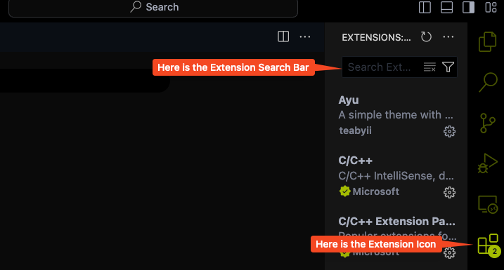
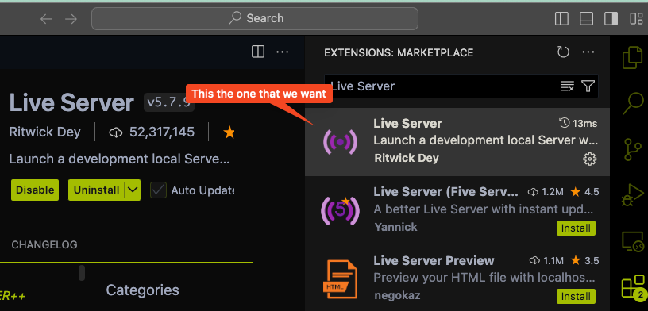
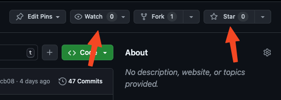

# Setting up your development environment

## Visual Studio Code (VSCode)

The first thing that you would need is a text editor. For more complex projects you would probably need an Integrated Development Environtment (IDE) instead, but for the purpose of this portfolio a text editor is more than good enough. The official text editor that will be supported in this course is VSCode due to its popularity, ease of configuration and useful plugins.

To download VSCode, just follow the instruction provided on this website 
<a href="https://code.visualstudio.com/" target="_blank">VSCode</a>. 

Here is a basic Youtube tutorial for those of you who would like to learn a bit more about your new shiny text editor:
<a href="https://www.youtube.com/watch?v=B-s71n0dHUk" target="_blank">VSCode Tutorial</a>.

It is advised to get somewhat comfortable with using VSCode as it is quite an industry standard for programming, and it also will make your life easier in general.

## VSCode extension

VSCode has a lot of what we called extensions. They are essentially package or "app" that is written by other people to help extend the functionality of VSCode. For this tutorial, we will install an extension that helps us with live previewing our website. Without this plugin, we would need to click reload on our browser everytime we made a change to the website, which is not very fun to do every 5 minutes or so.

Click on the extensions Icon as shown above.

Type in the Extensions Search Bar section: **Live Server**

Open up the results that say:

> Live Server
> 
> Ritwick Dey

Just click the **Install** button and you are set. You should be able to see a small broadcasting symbol at the bottom of the VSCode window (usually on the bottom right) that looks like this.

## Git

Next you will need to learn how to use a version control system or source control management (scm) depend on who you ask. In this course, our official supported scm is [Git](https://git-scm.com/). Please visit the link provided, and follow their instruction to set it up on your computer.

If you are wondering what is Git and want to learn more about this very important industry standard tool, here is a link to a great [introductory video](https://cs50.harvard.edu/web/2020/weeks/1/) to Git by Brian from Harvard CS50 course.

## Github

Please sign up for a Github account at <a href="https://github.com/" target="_blank">Github</a>. Github is where you can upload your own git repository or download other git repository (think dropbox or Google Drive but for code). This is also where your websites and all the resources for this tutorial will be hosted **FOR FREE**!!!

While you are at it, remember to give a star to <a href="" target="_blank">this tutorial</a> and watch us on Github. It would give us some internet clout :"), but more importantly it will notify your account and your email if new update is made to the tutorial so you can keep an eyes out for it.

